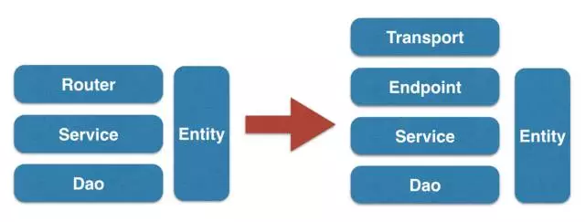

# 微服务工具

## RPC服务

### 可插拔的RPC服务 go-micro

项目地址 https://github.com/micro/go-micro

- 介绍
基于微服务库的可插拔 RPC，为编写分布式应用程序提供基本构件。它是[Micro](https://github.com/micro/micro)工具包的一部分，支持 Proto-RPC 和 JSON-RPC 的请求/响应协议，默认设置Consul为探索

使用时先安装 [InstallConsul](https://www.consul.io/intro/getting-started/install.html)

- 特点

|特征|包|内置插件|描述|
|---|---|---|---|
|Discovery|[Registry](https://godoc.org/github.com/micro/go-micro/registry)|consul|用来沟通的一种定位服务方式|
|Client|[Client](https://godoc.org/github.com/micro/go-micro/client)|rpc|用来将RPC请求变成服务|
|Codec|[Codec](https://godoc.org/github.com/micro/go-micro/codec)|proto,json|对请求进行编码/解码处理|
|Balancer|[Selector](https://godoc.org/github.com/micro/go-micro/selector)|random|服务节点过滤和池|
|Server|[Server](https://godoc.org/github.com/micro/go-micro/server)|rpc|监听和服务器的RPC请求|
|Pub/Sub|[Broker](https://godoc.org/github.com/micro/go-micro/broker)|http|发布和订阅事件|
|ransport|[Transport](https://godoc.org/github.com/micro/go-micro/transport)|http|服务之间的通信机制|

- 必备条件
需要一个服务发现机制来解决服务的名称到地址的映射，默认设置Consul为探索。
Discovery是可插拔的，你可以使用 kubernetes, zookeeper 等

```sh
# 运行Consul
consul agent -dev -advertise=127.0.0.1
# 运行go-micro
go run examples/service/main.go
# 测试服务
go run examples/service/main.go --client
```

- 使用示例项目

|项目|描述|
|---|---|
|[greeter](https://github.com/micro/micro/tree/master/examples/greeter)|greeter 服务(包括 Go、Ruby、Python )|
|[geo-srv](https://github.com/micro/geo-srv)|使用 hailocab/go-geoindex 进行地理位置跟踪服务|
|[geo-api](https://github.com/micro/geo-api)|为地理位置跟踪和搜索提供的 HTTP API 处理程序|
|[geocode-srv](https://github.com/micro/geocode-srv)|使用 Google Geocoding API 提供地理编码服务|
|[hailo-srv](https://github.com/micro/hailo-srv)|一种用于hailo出租车服务开发者的api服务|
|[place-srv](https://github.com/micro/place-srv)|存储和检索地点的微服务|
|[slack-srv](https://github.com/micro/slack-srv)|将Slack机器人的API当成一个go-micro 的RPC服务|
|[twitter-srv](https://github.com/micro/twitter-srv)|一种用于Twitter的API微服务|
|[user-srv](https://github.com/micro/user-srv)|一种为用户管理和认证提供的微服务|

## go-kit

https://github.com/go-kit/kit

组件化，可扩展微服务工具集，非常适合领域驱动的微服务

go-kit 分为 三层

- Transport层 传输协议相关
- Endpoint层 负责request／response格式的转换，以及公用拦截器相关的逻辑
- Service层 专注于业务逻辑

> endpoint层提供了很多公用的拦截器，如log，metric，tracing，circuitbreaker，rate-limiter

如果已有项目的模版是分为三层：router，service和dao
且之前的代码中router层不能包含任何业务逻辑
集成到go-kit也分为三层，可以根据每层职责的不同进行重新组合，从上到下依次为：transport层，endpoint层，service层，dao层

<!--  -->


> 当然你如果哪天因为某种原因，不想再继续使用go-kit这套东西，直接將endpoint层和Transport层移除即可

集成过程必须满足

- 单一职责原则
- 开放封闭原则
- 依赖倒置原则
- 接口隔离原则
